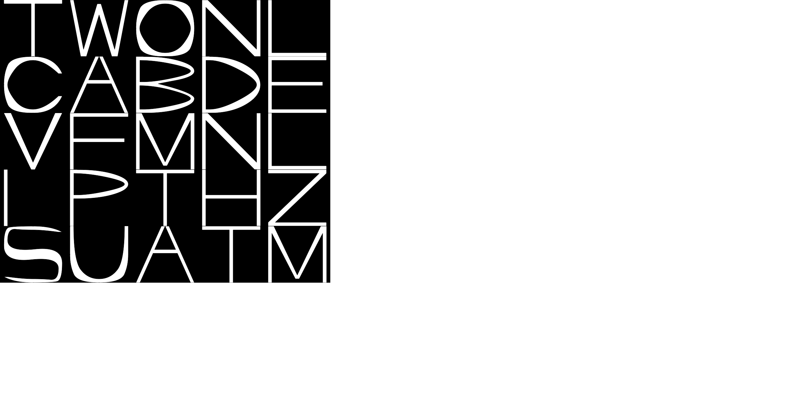
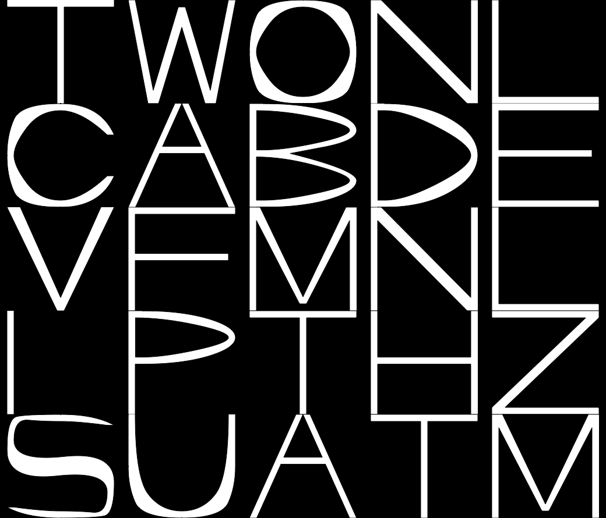

# Letter-Studio-Python-Process
# Gif and more of chosen combinations.

## Animated combinations of letters

## Presentation of the letters which don't include circular shapes. That demonstrates how it does look without letters overlapping much and without the contrast added by the way the circularly shaped latters behave. 

## One other animated combination

### Archive of chosen combinations

## Test with changing the size of the page

## Test with changing the width and height of the glyphs

