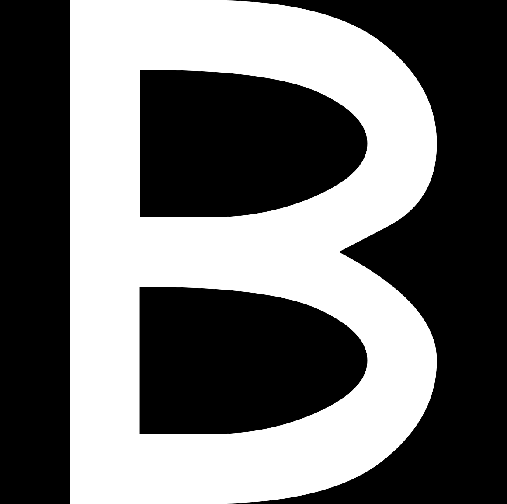

# Python Scripting Process (.gifs and selected combinations)

## Animated combinations of letters


## Single Letters


```python
for i in range(frames):
  factor = i / frames
        
  thickness = startThickness + (nextThickness-startThickness) * factor
  middleLine = startMiddleLine + (nextMiddleLine-startMiddleLine) * factor
  roundness = startRoundness + (nextRoundness-startRoundness) * factor
  propNumb = startPropNumb + (nextPropNumb-startPropNumb) * factor
        
        
  if propNumb == 0:
  propNumb = 0.000001
    
  newPage(glyphWidth , capHeight/4 * len(lines))
  translate(0, height()-capHeight)

  for line in lines:
      with savedState():
        for func in line:
          func()
      translate(0, -capHeight)


  startThickness = nextThickness
  startMiddleLine = nextMiddleLine
  startRoundness = nextRoundness
  startPropNumb = nextPropNumb

```




### Archive of chosen combinations


# Not the best presentable part 

### Test with changing the size of the page


### Test with changing the width and height of the glyphs


### Presentation of the letters which don't include circular shapes. That demonstrates how it does look without letters overlapping much and without the contrast added by the way the circularly shaped latters behave. 


### One other animated combination


